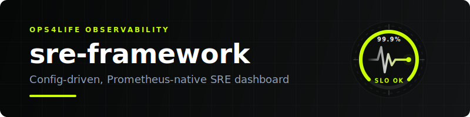

<p align="center">
  
</p>

# SRE Framework

An open-source SRE Ops dashboard that helps teams apply Site Reliability Engineering practices. Config-driven, Prometheus-native, ships with a zero-infra demo stack.

**MIT License · FastAPI + React + Vite · Docker Compose**

[](https://github.com/ops4life/sre-framework/actions/workflows/ci.yml)
[](https://hub.docker.com/r/ops4life/sre-framework)
[](https://sonarcloud.io/summary/new_code?id=ops4life_sre-framework)
[](https://sonarcloud.io/summary/new_code?id=ops4life_sre-framework)
[](https://sonarcloud.io/summary/new_code?id=ops4life_sre-framework)
[](https://sentry.io)

---

## Quickstart (zero infra required)

**From DockerHub (no build needed):**

```bash
docker run -p 8000:8000 ops4life/sre-framework:latest
```

**From source:**

```bash
git clone https://github.com/ops4life/sre-framework
cd sre
docker compose -f demo/docker-compose.yml up --build
```

Open **http://localhost:8080** — live SRE dashboard with synthetic metrics from three fake services (`frontend`, `api`, `worker`). No Traefik, no Prometheus to install, no real services needed.

---

## Use your own metrics

### 1. Pick a provider preset

| Preset | Works with |
|--------|-----------|
| `traefik` | Traefik reverse proxy + dockerstats + node_exporter |
| `http` | Any app exposing `http_requests_total` + `http_request_duration_seconds_bucket` |

### 2. Write `sre.yaml`

```yaml
provider: http          # or "traefik"
default_service: api

services:
  - name: api
    slo_target: 99.5
    labels:
      service: api       # fills {service} in query templates

  - name: frontend
    slo_target: 99.9
    labels:
      service: frontend
```

For the `traefik` preset, add a `container` label too:
```yaml
    labels:
      service: devex-svc@file
      container: devex
```

### 3. Run

```bash
docker compose up --build
```

Set `PROMETHEUS_URL` and `SRE_CONFIG_FILE` in your `.env` (see `.env.example`).

### 4. Custom query overrides

Add a `queries:` block to `sre.yaml` to override or extend the preset:

```yaml
provider: http
queries:
  # replace the default availability query
  availability: 'avg_over_time(my_custom_up{job="{service}"}[{window}]) * 100'
  # add a signal the preset doesn't have
  saturation: 'my_cpu_ratio{container="{container}"}'
```

---

## Learn Mode

Toggle the **`? Learn`** button in the top bar to enable concept tooltips on every panel. Hover over any `?` badge to see what the metric means, how it's computed, and a link to the [CONCEPTS.md](./CONCEPTS.md) primer.

Useful for engineers new to SRE, or for walkthroughs with stakeholders.

---

## Environment variables

### Infrastructure

| Variable | Default | Description |
|----------|---------|-------------|
| `PROMETHEUS_URL` | `http://prometheus:9090` | Prometheus API endpoint |
| `SRE_CONFIG_FILE` | `app/config/sre.yaml` | Path to main config (mount your own without rebuilding) |
| `TRAEFIK_HOST` | _(ops4life-only)_ | Domain for Traefik TLS routing |
| `COMPOSE_PROJECT_NAME` | `sre` | Docker Compose project name |

### UI customization

Injected at serve time — no rebuild required.

| Variable | Default | Description |
|----------|---------|-------------|
| `SRE_TITLE` | `SRE Ops — Mission Control` | Browser tab title and dashboard heading |
| `SRE_TIMEZONE` | `UTC` | Clock display timezone — any IANA string (e.g. `America/New_York`). Run `timedatectl list-timezones` or see [tz database](https://en.wikipedia.org/wiki/List_of_tz_database_time_zones) |
| `SRE_WINDOW` | `28d` | SLO and error budget evaluation window — day format only (e.g. `7d`, `30d`) |
| `SRE_FAVICON` | `/favicon.png` | URL to a custom favicon **and** sidebar logo. To serve a local file, mount it into `frontend/dist/` and reference it by path |

```bash
# .env example
SRE_TITLE=Acme SRE Dashboard
SRE_TIMEZONE=America/Chicago
SRE_WINDOW=30d
```

---

## Architecture

```
sre/
├── app/                        # FastAPI backend
│   ├── config_loader.py        # load sre.yaml + provider preset, render PromQL
│   ├── metrics.py              # query logic (config-driven, provider-agnostic)
│   ├── prometheus.py           # Prometheus HTTP client
│   └── config/
│       ├── sre.yaml            # main user config
│       └── providers/
│           ├── traefik.yaml    # Traefik preset
│           └── http.yaml       # generic HTTP RED preset
├── frontend/                   # React + Vite
│   └── src/
│       ├── components/         # KpiStrip, SloTable, GoldenSignals, ErrorBudgetBurn, CapacityGrid
│       └── content/concepts.ts # SRE concept definitions (for Learn Mode)
├── demo/                       # standalone zero-infra demo stack
│   ├── docker-compose.yml
│   ├── metrics-generator/      # synthetic Prometheus metrics for 3 fake services
│   ├── prometheus.yml
│   └── sre.demo.yaml
├── tests/                      # pytest: config loader unit tests
├── CONCEPTS.md                 # SRE primer
└── CONTRIBUTING.md
```

**Data flow:** Browser → FastAPI `/api/sre/overview` → `config_loader` renders PromQL → `prometheus.py` queries Prometheus → JSON response → React components.

---

## Adding a provider preset

Create `app/config/providers/<name>.yaml`:

```yaml
name: mystack
latency_unit: seconds   # or "milliseconds"
queries:
  availability: '...'
  request_rate: '...'
  latency_p99:  '...'
  error_rate:   '...'
  saturation:   '...'    # optional — panel renders null if absent
  cap_vps_cpu:  '...'    # optional
  cap_vps_mem:  '...'    # optional
  cap_vps_disk: '...'    # optional
  cap_container_cpu: '...'  # optional
  cap_container_mem: '...'  # optional
```

Use `{service}`, `{container}`, `{window}` as placeholders. Escape literal PromQL `{}` as `{{` and `}}`.

Then set `provider: mystack` in `sre.yaml`.

---

## CI / Docker image

Every push to `main` runs the full CI pipeline and publishes a new image to DockerHub:

```
ops4life/sre-framework:latest   # always tracks main
ops4life/sre-framework:<sha>    # pinned to commit
```

**Pipeline stages:**
1. Python tests — `pytest tests/`
2. Frontend — `tsc -b && vite build`
3. Docker build + push (amd64 + arm64) — main branch only

## Running tests locally

```bash
python -m venv .venv && source .venv/bin/activate
pip install -r requirements.txt -r requirements-dev.txt
pytest tests/ -v
```

Frontend:

```bash
cd frontend && pnpm install && pnpm run build
```

---

## Contributing

See [CONTRIBUTING.md](./CONTRIBUTING.md).
